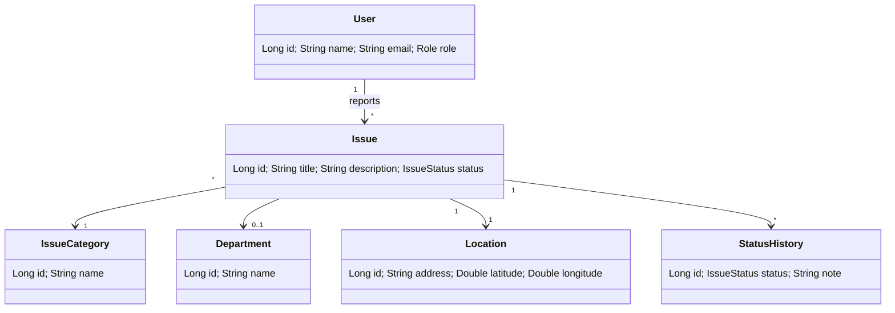

# Class Diagram

```mermaid
classDiagram
    User "1" --> "*" Issue : reports
    Issue "*" --> "1" IssueCategory
    Issue "*" --> "0..1" Department
    Issue "1" --> "1" Location
    Issue "1" --> "*" StatusHistory
    class User { Long id; String name; String email; Role role }
    class Issue { Long id; String title; String description; IssueStatus status }
    class IssueCategory { Long id; String name }
    class Department { Long id; String name }
    class Location { Long id; String address; Double latitude; Double longitude }
    class StatusHistory { Long id; IssueStatus status; String note }
```
