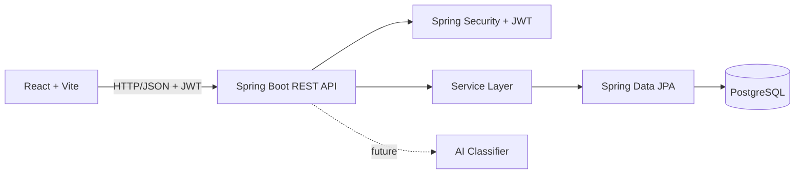

# System Architecture

## Layers
- Controller: HTTP/API boundary
- Service: business rules
- Repository: persistence
- Entity: domain model
- DTO: request/response contracts
- Security: JWT authentication
- Exception: consistent API errors
