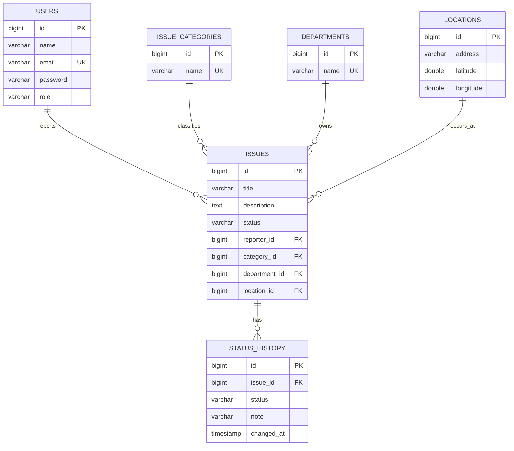

# ER Diagram

```mermaid
erDiagram
    USERS ||--o{ ISSUES : reports
    ISSUE_CATEGORIES ||--o{ ISSUES : classifies
    DEPARTMENTS ||--o{ ISSUES : owns
    LOCATIONS ||--o{ ISSUES : occurs_at
    ISSUES ||--o{ STATUS_HISTORY : has

    USERS {
      bigint id PK
      varchar name
      varchar email UK
      varchar password
      varchar role
    }
    ISSUE_CATEGORIES {
      bigint id PK
      varchar name UK
    }
    DEPARTMENTS {
      bigint id PK
      varchar name UK
    }
    LOCATIONS {
      bigint id PK
      varchar address
      double latitude
      double longitude
    }
    ISSUES {
      bigint id PK
      varchar title
      text description
      varchar status
      bigint reporter_id FK
      bigint category_id FK
      bigint department_id FK
      bigint location_id FK
    }
    STATUS_HISTORY {
      bigint id PK
      bigint issue_id FK
      varchar status
      varchar note
      timestamp changed_at
    }
```
